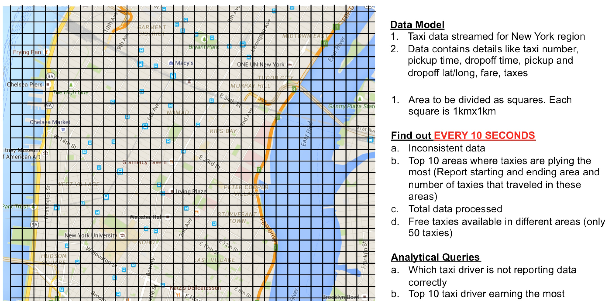
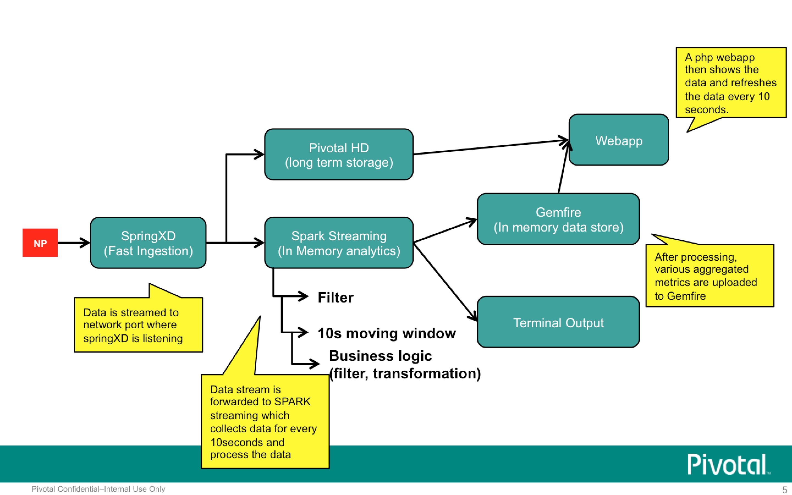

== Real Time Streaming demo using Pivotal Stack

This demo aims to solve following problem that appeared in DEBS challenge 2015

http://www.debs2015.org/call-grand-challenge.html

Stream of taxi data comes in real time for new york region. Region is to be divided into areas, each measuring 300mx300m. Following questions needs to be solved in real time

----

Question 1 - For every 10 seconds, find out the top 10 routes where taxies are plying the most from one area to another area.

Question 2 - For every 10 seconds, find out the top 3 routes (areas) 

Question 3 - For every 10 seconds, find out free taxies (show only 50 in the map) available in the region

Question 4 - For every 10 seconds, find out how much data is incorrectly reported by taxi drivers

Question 5 - For every 10 seconds, find out how much time does your product takes to compute the above 4 things

Below questions need not be answered in real time -

Question 6 - For overall data, find out who are the taxi drivers not reporting the data correctly

Question 7 - For overall data, find out top 10 taxi drivers earning the most

=== Solution Architecture

We use following Pivotal products to implement the solution

a. SpringXD (real time data gets ingested via SpringXD
b. Spark (real time streams are sent to Spark for computing Q1-5 above)
c. Gemfire (output from Spark goes into Gemfire)
d. PHD/HAWQ (streams are also sent to PHD so that we could answe Q6 and A7 above)
e. Application using PHP and Google Charts

See the below diagram for the stack used. NP stands for network packets so the stream would come as traffic on machine network port. SpringXD would be listening to this port.

----

